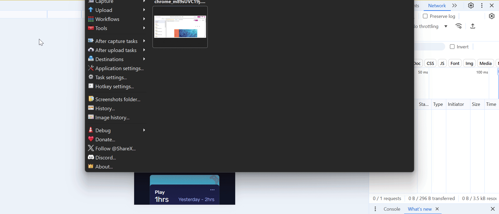

# Frontend Mentor - Time tracking dashboard solution

This is a solution to the [Time tracking dashboard challenge on Frontend Mentor](https://www.frontendmentor.io/challenges/time-tracking-dashboard-UIQ7167Jw). Frontend Mentor challenges help you improve your coding skills by building realistic projects.

## Table of contents

- [Overview](#overview)
  - [The challenge](#the-challenge)
  - [Screenshot](#screenshot)
  - [Links](#links)
- [My process](#my-process)
  - [Built with](#built-with)
  - [What I learned](#what-i-learned)
  - [Continued development](#continued-development)
- [Author](#author)

## Overview

### The challenge

Users should be able to:

- View the optimal layout for the site depending on their device's screen size
- See hover states for all interactive elements on the page
- Switch between viewing Daily, Weekly, and Monthly stats

### Screenshot



### Links

- Solution URL: [Github link](https://github.com/snigdha-sukun/time-tracking-dashboard)
- Live Site URL: [Time tracking dashboard](https://time-tracking-dashboard-seven-gules.vercel.app/)

## My process

### Built with

- Semantic HTML5 markup
- CSS custom properties
- Flexbox
- CSS Grid
- Vanilla Javascript

### What I learned

I learned how to use `fetch`:

```js
fetch('./data.json').then((response) => {
    if (!response.ok) return console.log('Oops! Something went wrong.');
    return response.json();
}).then((data) => {
    json_data = data;
    updateData('daily');
});
```
I learned how to manipulate html content from js:
```js
selfCareCurrent.textContent = `${json_data[i].timeframes[selected].current}hrs`;
```

I learned how to use `:not` and `:has` in CSS:
```css
.content:hover:not(:has(.ellipsis:hover)) {
    cursor: pointer;
    background-color: var(--card-hover);
}
```

### Continued development

I still need to practice the positioning an element & `@media`. I need to practice using JS for making the UI to react to different events. I also need to learn about responsive CSS, HTML5 rules & JS.

## Author

- Frontend Mentor - [@snigdha-sukun](https://www.frontendmentor.io/profile/snigdha-sukun)
